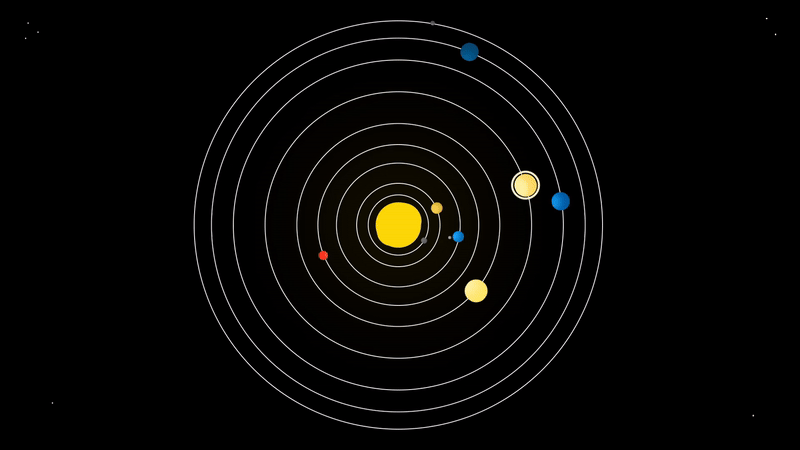
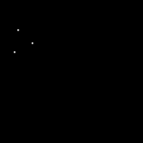
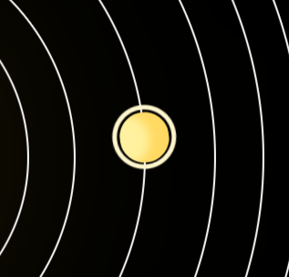

## Solar System

### 1. Pulsing sun
Pulzující Slunce pomocí 3 divů ve tvaru oválů s rotační animací a box-shadow.

### 2. Orbiting planets
Planety orbitují pomocí rotační animace a divu umístěného ve středu.
Dohromady obsahuje 8+1 planet.

### 3. Planets orbit at different speed and distance 
Planety orbitují různou rychlostí a vzdáleností pomocí použití rotační animace na každou planetu a manuálně dané vzdálenosti.

### 4. Rotating moon
  Měsíc rotuje okolo země pomocí divu určeného pro rotaci, který je umístěn na div země. 
  

### 5. Sun rays on planets
Planety mají osvícenou část, na kterou dopadá světlo ze Slunce, pomocí box-shadow.

### 6. Background stars
 Hvězdy na pozadí jsou usměrovány pomocí několika divů a manuálního umístění.
 

### 7. Planet trajectory
Planety mají vyznačenou svou trajektorii pomocí umístění divů kulatého, bezbarvého tvaru se solid borderem na divu Slunce.

### 8. Planet ring
Planeta Saturn má svůj prstenec pomocí vytvořeného divu kulatého, bezbarvého tvaru a solid borderu, který je umístěn na divu Saturnu.

